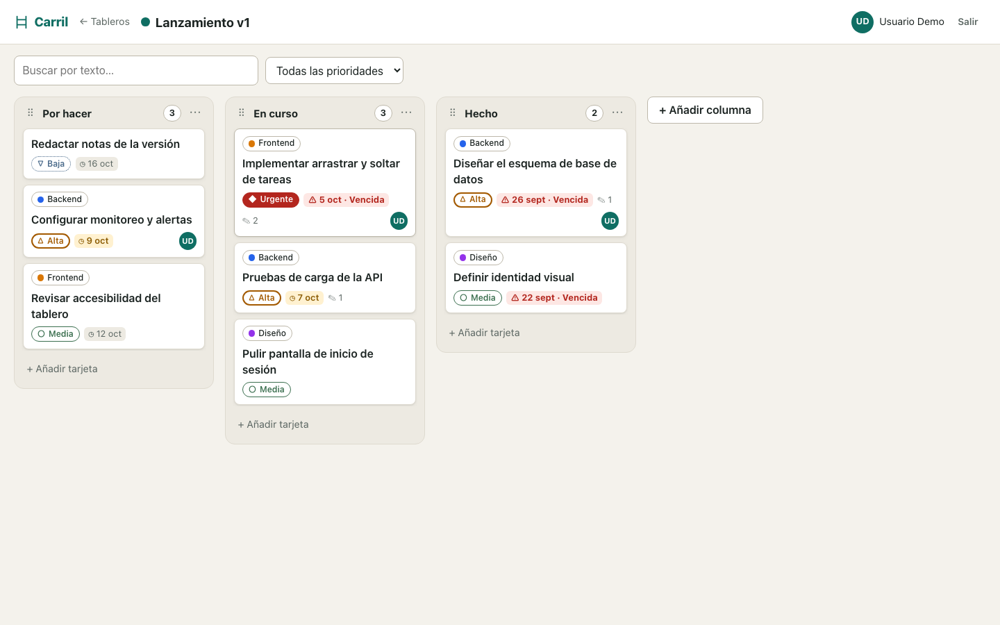
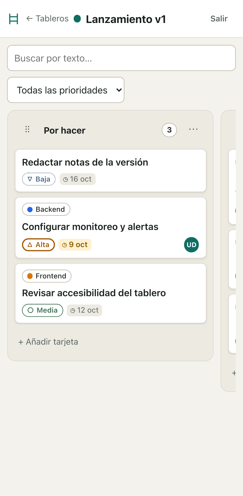
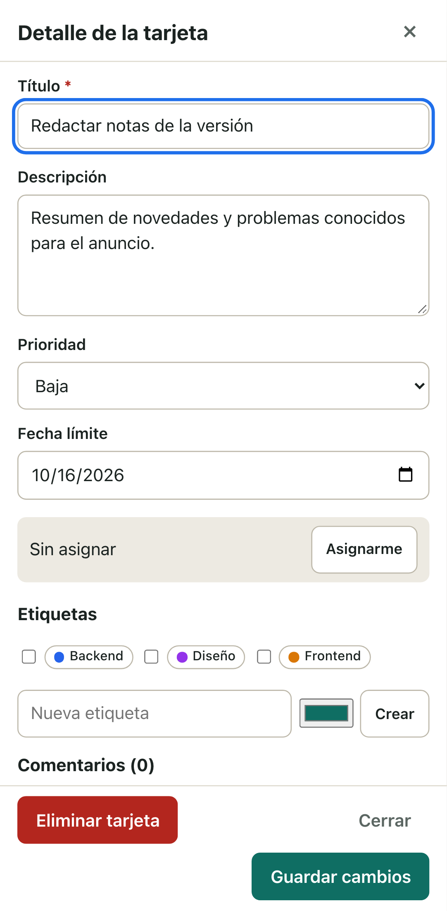
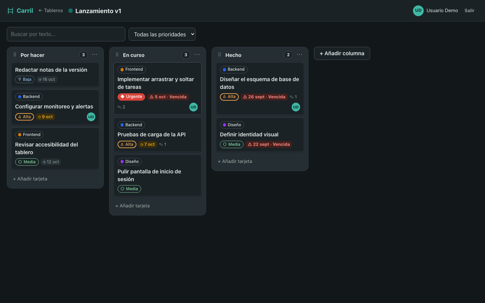

<p align="center">
  
</p>

<h1 align="center">Carril</h1>

<p align="center">Gestor de tareas Kanban: tableros, columnas y tarjetas que se arrastran con ratón, teclado o dedo.<br>Se instala en el celular como app (PWA).</p>

<p align="center">
  
</p>

<table align="center">
  <tr>
    <td></td>
    <td></td>
    <td></td>
  </tr>
</table>

## Qué hace

- **Tableros** con columnas reordenables y límite WIP opcional (la columna se marca cuando se supera).
- **Tarjetas** con prioridad, fecha límite (las vencidas se resaltan), asignación, etiquetas y comentarios.
- **Arrastrar y soltar** dentro de una columna y entre columnas, con actualización optimista. En táctil se usa pulsación larga; también se pueden mover con el teclado (Alt + flechas).
- **Filtros** por texto y por prioridad.
- **PWA instalable**: icono propio, pantalla completa, aviso de nueva versión y de "sin conexión". Modo claro y oscuro.
- Cuentas con JWT; cada usuario solo ve sus tableros.

## Stack

| Carpeta | Qué es | Tecnología | Docs |
|---|---|---|---|
| [`database/`](database/) | Esquema, datos de ejemplo y pruebas del esquema | PostgreSQL 16 | [database/docs](database/docs/README.md) |
| [`backend/`](backend/) | API REST `/api/v1` | FastAPI, SQLAlchemy async, asyncpg (Docker) | [backend/docs](backend/docs/README.md) |
| [`frontend/`](frontend/) | La app | Angular 19 sin librerías de UI, signals, service worker | [frontend/docs](frontend/docs/README.md) |
| [`docs/`](docs/) | Contrato compartido, arquitectura, validación y vista previa | | [CONTRACT](docs/CONTRACT.md) |

`docs/CONTRACT.md` es la fuente de verdad entre los tres proyectos (esquema, tipos y endpoints).

## Empezar

Requisitos: Docker Desktop (Compose v2), Node 20.12+ y, solo para correr las pruebas de Python fuera de Docker, Python 3.12+.

```bash
cp .env.example .env
openssl rand -hex 32                       # pega el valor en JWT_SECRET dentro de .env
docker compose up -d --build               # PostgreSQL :5432 + API :8000
cd frontend && npm install && npm start    # http://localhost:4200
```

- Usuario de ejemplo: `demo@carril.dev` / `demo1234`.
- API interactiva (Swagger): http://localhost:8000/docs.
- El esquema se aplica en el primer arranque del volumen. Para recrear la base: `docker compose down -v && docker compose up -d --build`.

## Usarla en el celular

| Opción | Para qué | Guía |
|---|---|---|
| **Vista previa con Tailscale** | Probar en tus propios dispositivos, gratis, desde tu computadora y solo para ti | [docs/PREVIEW.md](docs/PREVIEW.md) |
| **Despliegue en un servidor** | Publicarla con dominio y HTTPS (Caddy delante de la API y el frontend) | [backend/docs/DEPLOYMENT.md](backend/docs/DEPLOYMENT.md) |

Con la app abierta: en Android, Chrome → ⋮ → "Instalar app"; en iPhone, Safari → Compartir → "Agregar a inicio". Más detalles en [frontend/docs/MOBILE.md](frontend/docs/MOBILE.md).

## Pruebas

Cada proyecto tiene pruebas unitarias, de integración y end to end (Playwright para el frontend, también en un celular emulado):

```bash
cd database && .venv/bin/pytest                              # esquema
cd backend  && .venv/bin/pytest -m "unit or integration" --cov=app && .venv/bin/pytest -m e2e
cd frontend && npm run test:unit && npm run test:integration && npm run test:e2e
```

Instalación de cada entorno y detalles en el `docs/TESTING.md` de cada carpeta. El informe de validación independiente está en [docs/VALIDATION.md](docs/VALIDATION.md).
