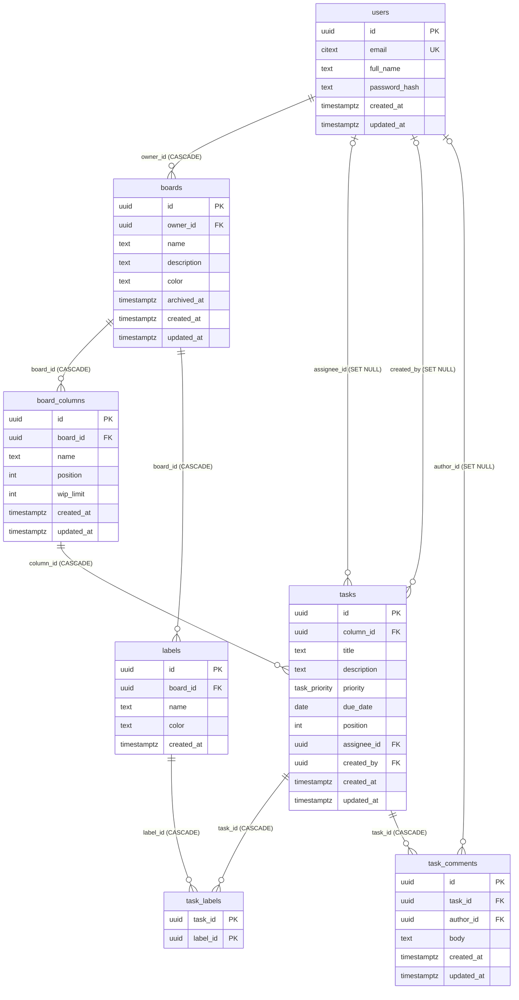

# Diagrama ER

```mermaid
erDiagram
    users ||--o{ boards : "owner_id (CASCADE)"
    boards ||--o{ board_columns : "board_id (CASCADE)"
    board_columns ||--o{ tasks : "column_id (CASCADE)"
    users |o--o{ tasks : "assignee_id (SET NULL)"
    users |o--o{ tasks : "created_by (SET NULL)"
    boards ||--o{ labels : "board_id (CASCADE)"
    tasks ||--o{ task_labels : "task_id (CASCADE)"
    labels ||--o{ task_labels : "label_id (CASCADE)"
    tasks ||--o{ task_comments : "task_id (CASCADE)"
    users |o--o{ task_comments : "author_id (SET NULL)"

    users {
        uuid id PK
        citext email UK
        text full_name
        text password_hash
        timestamptz created_at
        timestamptz updated_at
    }
    boards {
        uuid id PK
        uuid owner_id FK
        text name
        text description
        text color
        timestamptz archived_at
        timestamptz created_at
        timestamptz updated_at
    }
    board_columns {
        uuid id PK
        uuid board_id FK
        text name
        int position
        int wip_limit
        timestamptz created_at
        timestamptz updated_at
    }
    tasks {
        uuid id PK
        uuid column_id FK
        text title
        text description
        task_priority priority
        date due_date
        int position
        uuid assignee_id FK
        uuid created_by FK
        timestamptz created_at
        timestamptz updated_at
    }
    labels {
        uuid id PK
        uuid board_id FK
        text name
        text color
        timestamptz created_at
    }
    task_labels {
        uuid task_id PK
        uuid label_id PK
    }
    task_comments {
        uuid id PK
        uuid task_id FK
        uuid author_id FK
        text body
        timestamptz created_at
        timestamptz updated_at
    }
```
